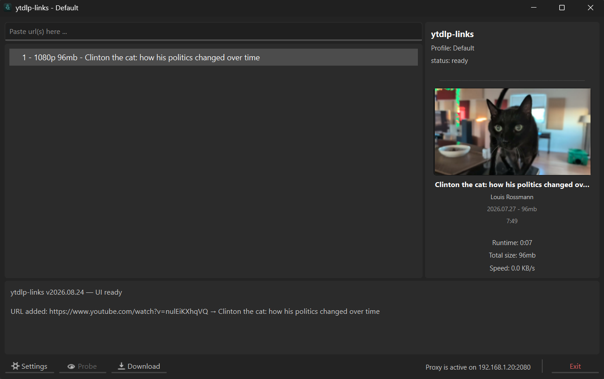

# ytdlp-links

ytdlp-links is a link manager and downloader (generally a skin) for yt-dlp. Designed with unstable connections and censored regions in mind.

Some features are:

* old school UI, design aim is to show a lot of information in a single window
* link grabber, can paste single link, multiple links, playlist and channels
* scheduler, for people who have cheaper bandwidth at certain times of day (or night)
* profile-wide quality, also each link (or group of links) can have alternate quality forced
* probing links would rename them, collect info such as size, runtime, thumbnail and ...
* everything is stored in simple json, can be browsed, or backed up as easy as copying somewhere else
* no install required, portable, everything self-contained in it's own directory.
 

  

 

# profiles

Each profile is basically an instance of the program, separate from others in terms of settings, links and thumbnails. Useful for when you want to keep track of certain links, channels or playlists but realistically are only needed on specific times like every few months. The rest of the time it is just cluttering the main page. In this case put it into separate profile and forget about it. It will be there the next time you switch to it.

Special profiles come with specific functionality like channels, playlist, subgroup. Some examples are specific numbering options and auto appending new videos to the list.

# dependencies

As this program is a skin for yt-dlp, it requires yt-dlp and ffmpeg to function, which are not bundled with the program. When those are missing, like the very first run of the program, it asks the user for permission to download the latest from github. The links the program uses are:

yt-dlp: https://github.com/yt-dlp/yt-dlp/releases/

ffmpeg: https://github.com/yt-dlp/FFmpeg-Builds/releases/

# update - maintenance

The program checks the official repository (see links in # dependencies) at every launch, and also every 6 hours if the program remains open. The about tab in settings provides info of version available and version installed. User can choose to update as desired (update never happens automatically without user choice).

Users will see update availble in log section and in settings sidebar. So the program should remain functional indefinitely as long as the yt-dlp project itself remains in development.

In case functionality of a nightly build is needed and the delay of few days to be pushed into main yt-dlp channel is unacceptable, nightly binaries can be placed manually in ytdlp-bin folder and will work.

# censored regions - low quality connections

This program comes with 2 features specifically for those who in need.

First: SOCKS/HTTP proxy. Every 'proper' anti censorship tools is likely to come with upstream output. For example singbox clients usually are on port 2080, v2ray on port 10808 and mihomo on port 7897. Best find whatever that works for you, and feed its output into the program.

Second: Robust retry logic. When a bad connection will usually cause a failed download, here will be seen as a 'hiccup'. When a hiccup occurs, another retry will immediately happen, up to 4 times (configurable). If during retry number 1 to 4 any bytes gets downloaded (progress), this counter will reset, ready to retry 4 more times. This way program brute forces itself to completion even on questionable connection qualities.

# support

This project is the result of years using various downloaders and imagining a wishlist of functionalities. If this program happens to be helpful to you please consider donating using one of the methods below. It encourages development for more free useful programs.

   Bitcoin&nbsp;&nbsp;&nbsp;&nbsp;&nbsp;&nbsp;&nbsp;&nbsp;&nbsp;&nbsp;&nbsp;&nbsp;&nbsp; : bc1q8vwyhuxjwnlnp65n8n6x47gsud5mngar6a3avx 
   Ethereum&nbsp;&nbsp;&nbsp;&nbsp;&nbsp;&nbsp;&nbsp;&nbsp;&nbsp; : 0x412eeD82a0F251a81eB69Dff951f0659Db9A5081 
   USDT (ERC20)&nbsp;&nbsp; : 0x412eeD82a0F251a81eB69Dff951f0659Db9A5081 
   TON&nbsp;&nbsp;&nbsp;&nbsp;&nbsp;&nbsp;&nbsp;&nbsp;&nbsp;&nbsp;&nbsp;&nbsp;&nbsp;&nbsp;&nbsp;&nbsp;&nbsp; : UQBDtAn1OFbrRWe5SetkkKFBXCvGoBorUyTrsOVHUwrf8Qi1

